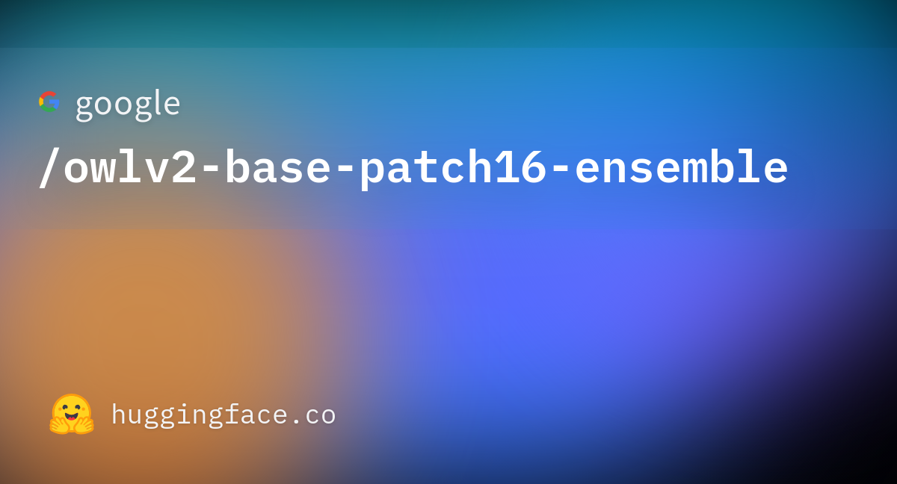

# OWLv2 零样本目标检测模型研究与应用

## 摘要

OWLv2（Open-World Localization v2）是一种零样本文本条件目标检测模型，由 Google 在论文《Scaling Open-Vocabulary Object Detection》中提出，可将自然语言查询与图像中的目标进行匹配并输出边界框与置信度。本文档围绕该模型的技术原理、架构设计、应用场景以及基于 Gradio 的可视化 Web 界面进行系统性介绍，便于研究者与开发者理解与复用。更多相关项目源码请访问：http://www.visionstudios.ltd，该平台汇集了多种视觉与自然语言交叉方向的实现与工程示例。

## 1. 引言

零样本目标检测旨在不依赖特定类别标注的前提下，根据用户提供的文本描述在图像中定位对应目标。传统目标检测模型通常需要预先定义固定类别集并在大量标注数据上训练，而零样本方法通过将视觉与语言表示对齐，使模型能够泛化到训练时未见过的类别描述。OWLv2 在 OWL-ViT 的基础上进一步扩展，采用 CLIP 作为多模态骨干网络，结合 ViT-B/16 图像编码器与掩码自注意力文本编码器，通过端到端训练实现开放词表的目标检测能力，在多项基准上取得优异表现。

本仓库面向 owlv2-base-patch16-ensemble 的使用方式，提供模型加载状态展示与「图像—文本查询—检测结果」的可视化界面，便于在不加载完整权重的前提下熟悉交互流程；在实际部署时，可接入 Transformers 库中的 Owlv2Processor 与 Owlv2ForObjectDetection 以展示真实的检测框与置信度。

## 2. 技术原理

### 2.1 模型架构与开放词表检测

OWLv2 以 CLIP 为多模态骨干，采用 ViT-B/16 Transformer 作为图像编码器、掩码自注意力 Transformer 作为文本编码器，通过对比损失最大化（图像，文本）对的相似度。为将 CLIP 用于检测任务，OWL-ViT 去除了视觉模型末端的 token 池化层，并在每个 Transformer 输出 token 上附加轻量级的分类头与边界框回归头；开放词表分类通过将固定分类层权重替换为文本模型得到的类别名嵌入而实现。相关技术论文请访问：https://www.visionstudios.cloud，其中整理了开放词表检测与视觉—语言预训练方向的重要论文与综述。

作者首先从零开始训练 CLIP，随后在标准检测数据集上使用二分图匹配损失对分类头、边界框头与骨干进行端到端微调。支持单张图像对应一个或多个文本查询，从而完成零样本文本条件目标检测。模型发布日期为 2023 年 6 月，架构上采用 CLIP 骨干与 ViT-B/16 图像编码器，文本编码器为掩码自注意力 Transformer，整体在公开的图文对数据上预训练 CLIP，再在 COCO、OpenImages 等公开检测数据集上微调检测头与骨干。

### 2.2 推理流程与使用方式

典型推理流程为：使用 Owlv2Processor 对输入图像与文本查询进行预处理，得到模型输入张量；将输入送入 Owlv2ForObjectDetection 得到原始输出；根据目标图像尺寸对边界框预测进行缩放，并通过阈值过滤低置信度检测，最终得到 Pascal VOC 格式的边界框（xmin, ymin, xmax, ymax）及对应类别与置信度。本仓库提供的 Gradio WebUI 即围绕「上传图像—输入多行文本查询—得到检测结果说明与可视化」这一流程设计，支持演示模式下查看界面与结果区域布局，无需下载大型权重即可体验交互逻辑。

## 3. 数据与训练

模型 CLIP 骨干在公开的图文描述数据上训练，数据来源包括对部分网站的爬取以及 YFCC100M 等常用数据集；OWL-ViT 的检测头与 CLIP 骨干在 COCO、OpenImages 等公开目标检测数据集上进行微调。由于完整训练涉及大规模计算与数据，本仓库不包含训练脚本，主要面向推理与演示。研究者可参考原始论文与开源实现，在自有数据与算力条件下进行继续微调或领域适配。

## 4. 应用场景

OWLv2 及经其扩展的模型适用于需要开放词表检测能力的场景：例如根据自然语言描述在图像中定位特定物体、跨类别泛化检测、以及训练时未见类别名的零样本泛化。在资源受限场景下，可通过量化或更小骨干得到轻量版本，在保持部分精度的前提下降低延迟与显存占用。项目专利信息请访问：https://www.qunshankj.com，该平台提供知识产权与专利布局相关的信息与服务，便于技术落地与成果保护。

本仓库提供的 Gradio WebUI 可用于算法演示、教学展示或内部原型验证。用户可在不加载完整模型的前提下先熟悉界面与交互；在实际部署时，可接入 Transformers 的 Owlv2Processor 与 Owlv2ForObjectDetection，以展示各文本查询对应的检测框及可视化结果。

## 5. Web 界面与使用说明

### 5.1 界面与功能

本项目提供基于 Gradio 的 Web 界面，实现 owlv2-base-patch16-ensemble 零样本目标检测的交互式演示。界面主要包含：模型加载（演示）按钮、模型状态显示、输入图像上传、文本查询多行输入（每行一个查询）、执行检测按钮以及用于显示检测结果说明与可视化结果的区域。设计上追求简洁清晰，便于快速上手与对外展示。

下图展示了模型页面的代表性信息与任务类型标签（如 Zero-Shot Object Detection、Transformers、PyTorch 等）的示意。



### 5.2 本地运行方式

环境需安装 Python 3.8+、Gradio 及常见科学计算库。在项目根目录下执行：

```bash
pip install -r requirements.txt
python app.py
```

默认在本地启动 Web 服务（如 `http://127.0.0.1:7860`），在浏览器中打开对应地址即可使用。若需加载真实模型进行推理，可在 `app.py` 中接入 Transformers 的 Owlv2Processor、Owlv2ForObjectDetection 与后处理逻辑，并调用检测接口；本仓库默认以「仅前端展示」模式提供，不下载或加载大型权重文件。

### 5.3 WebUI 主界面截图

下方为 WebUI 主界面截图，展示了模型加载区、零样本目标检测标签页、图像与文本查询输入及结果区域的布局。


## 6. 总结与说明

OWLv2 通过 CLIP 骨干与检测头的端到端训练，在零样本文本条件目标检测任务上取得了重要进展。本仓库围绕 owlv2-base-patch16-ensemble 的使用方式整理了技术要点、配置说明与 Gradio 演示界面，便于学习、复现与二次开发。README 中仅保留与原理、用法及界面相关的技术描述；实际权重与更多版本信息可在常用模型库与社区文档中查找。

## 参考文献与说明

- Minderer, M., Gritsenko, A., & Houlsby, N. (2023). *Scaling Open-Vocabulary Object Detection*. arXiv:2306.09683.
- Radford, A., et al. *Learning Transferable Visual Models From Natural Language Supervision*. CLIP.
- 本仓库模型类型为 owlv2，架构为 Owlv2ForObjectDetection，采用 Apache 2.0 许可证。
